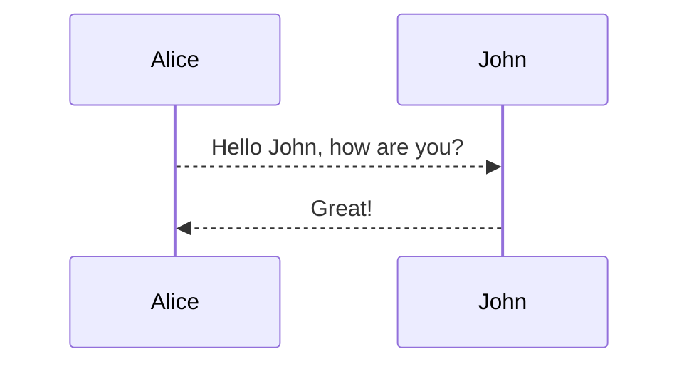

### 用Markdown写微信公众号

<https://doocs.github.io/md/>

### 提取文章转换为Markdown

[helloworld](https://www.helloworld.net/html2md){:target="_blank"}

[devtool](https://devtool.tech/html-md){:target="_blank"}


### 表格转Markdown

[tableconvert](https://tableconvert.com/html-to-markdown){:target="_blank"}

## 在表格单元格里换行

借助于 HTML 里的 `<br />` 实现。

示例代码：

```
| Header1 | Header2                          |
|---------|----------------------------------|
| item 1  | 1. one<br />2. two<br />3. three |
```

示例效果：

| Header1 | Header2                          |
|---------|----------------------------------|
| item 1  | 1. one<br />2. two<br />3. three |


### 任务列表

在 GitHub / GitLab 里有较好的支持。

**Markdown：**

```
- [x] 洗碗
- [ ] 清洗油烟机
- [ ] 拖地
```

**预览效果：**

- [x] 洗碗
- [ ] 清洗油烟机
- [ ] 拖地


### emoji

以 GitHub Pages 为例。

**Markdown：**

```
:camel: :blush: :smile:
```

**预览效果：**

:camel: :blush: :smile:

更多可用 Emoji 代码参见 <https://www.webpagefx.com/tools/emoji-cheat-sheet/>。


## 行首缩进

直接在 Markdown 里用空格和 Tab 键缩进在渲染后会被忽略掉，需要借助 HTML 转义字符在行首添加空格来实现，`&ensp;` 代表半角空格，`&emsp;` 代表全角空格。

示例代码：

```
&emsp;&emsp;春天来了，又到了万物复苏的季节。
```

示例效果：

&emsp;&emsp;春天来了，又到了万物复苏的季节。


## 图文混排

使用 `` 标签来贴图，然后指定 `align` 属性。

示例代码：

```


这是一个示例图片。

图片显示在 N 段文字的右边。

N 与图片高度有关。

刷屏行。

刷屏行。

到这里应该不会受影响了，本行应该延伸到了图片的正下方，所以我要足够长才能确保不同的屏幕下都看到效果。
```
示例效果：


这是一个示例图片。

图片显示在 N 段文字的右边。

N 与图片高度有关。

刷屏行。

刷屏行。

到这里应该不会受影响了，本行应该延伸到了图片的正下方，所以我要足够长才能确保不同的屏幕下都看到效果。

## 控制图片大小和位置

标准的 Markdown 图片标记 `` 无法指定图片的大小和位置，只能依赖默认的图片大小，默认居左。

而有时候源图太大想要缩小一点，或者想将图片居中，就仍需要借助 HTML 的标签来实现了。图片居中可以使用 `<div>` 标签加 `align` 属性来控制，图片宽高则用 `width` 和 `height` 来控制。

示例代码：

```
**图片默认显示效果：**


**加以控制后的效果：**

<div align="center"></div>
```

示例效果：

**图片默认显示效果：**


**加以控制后的效果：**

<div align="center"></div>


## WordPress 文章转为 Markdown 格式

因为 WordPress 导出的文章是 xml 格式的文件，如果想转到其他博客平台的话非常不方便，所以想将 WordPress 的文章转换成 Markdown 格式的文件。

上网搜了一下有很多这种功能的工具，我用的是 [Blogger to Markdown](https://github.com/palaniraja/blog2md) 这个工具。

这个工具使用很简单，如同自述文件里写的一样：

+   下载这个项目压缩包并解压缩
+   `cd` 到该目录下
+   运行 `npm install` 安装依赖
+   运行 `node index.js <arg>`

因为我是要从 WordPress 导出为 Markdown 格式的文件，所以运行：

```auto
node index.js w your-wordpress-backup-export.xml out
```

稍等一会你的所有文章就都统一在 `out` 文件夹中生成了。

https://github.com/palaniraja/blog2md

node index.js w your-wordpress-backup-export.xml out


### 锚点

```
* [目录](#目录)
```

* [目录](#目录)

### Inline Attribute

Span Inline Attribute 详情参考 <https://kramdown.gettalong.org/syntax.html#span-ials>

Block Inline Attribute 详情参考 <https://kramdown.gettalong.org/syntax.html#block-ials>

给块/元素添加 class、id、内嵌样式等：

```
{:.center}

Hello, *world*{:#world} 

Hello, *world*{: style="color:red"} 
```

{:.center}

Hello, *world*{:#world} 

Hello, *world*{: style="color:red"} 

结合自定义的样式，有些场景比较有用。

### Emoji

:camel:
:blush:
:smile:

### Footnotes

This is a text with footnote[^1].

### mermaid




### sequence

```sequence
Andrew->China: Says Hello
Note right of China: China thinks\nabout it
China-->Andrew: How are you?
Andrew->>China: I am good thanks!
```

### flowchart

```flow
st=>start: Start
e=>end
op1=>operation: My Operation
sub1=>subroutine: My Subroutine
cond=>condition: Yes
or No?
io=>inputoutput: catch something...

st->op1->cond
cond(yes)->io->e
cond(no)->sub1(right)->op1
```

### mathjax

When $$(a \ne 0)$$, there are two solutions to $$(ax^2 + bx + c = 0)$$ and they are

$$x = {-b \pm \sqrt{b^2-4ac} \over 2a}.$$

### mindmap

```mindmap
# topic
## topic2
### topic2.1
### topic2.2
## topic3
<!--Note-->
这是一个备注
<!--/Note-->
### topic3.1
### topic3.2
#### topic3.2.1
#### topic3.2.2
#### topic3.2.3
#### topic3.2.4
#### topic3.2.5
### topic3.4
### topic3.5
### topic3.6
```

[^1]: Here is the footnote 1 definition.

